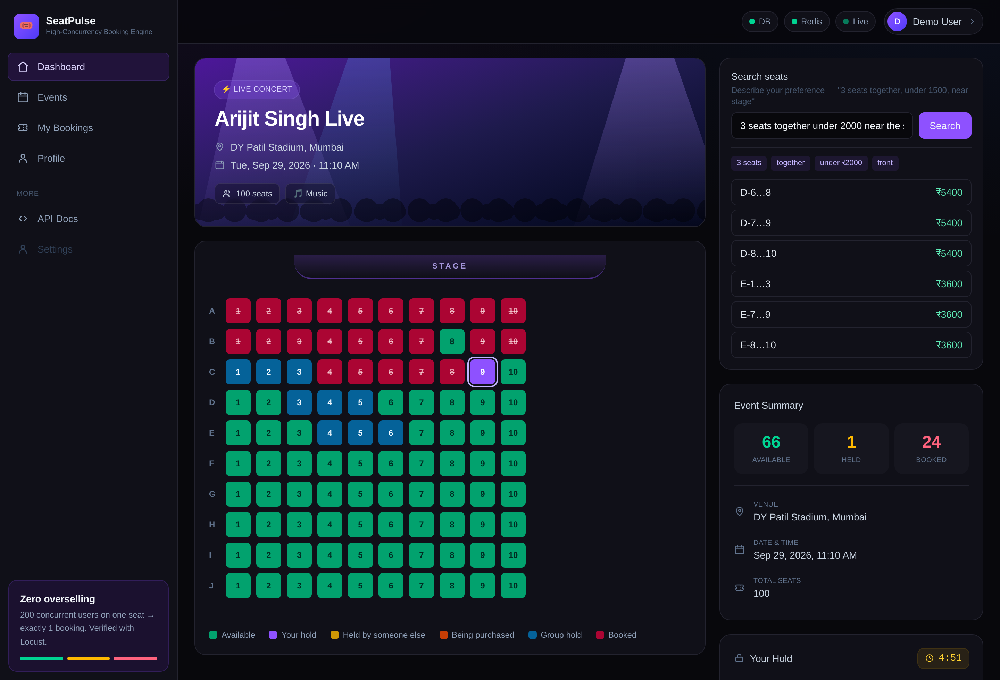
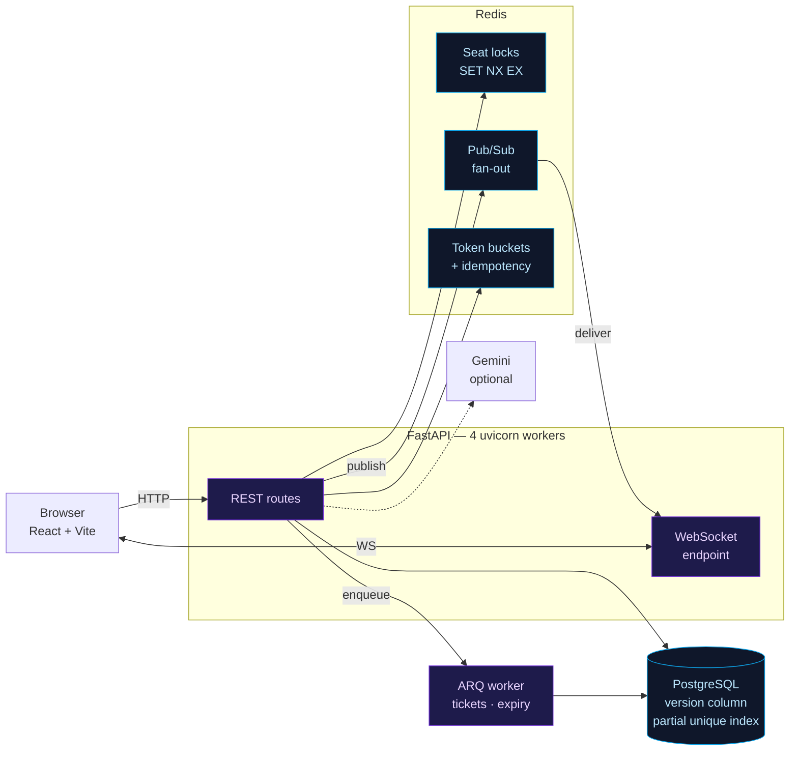
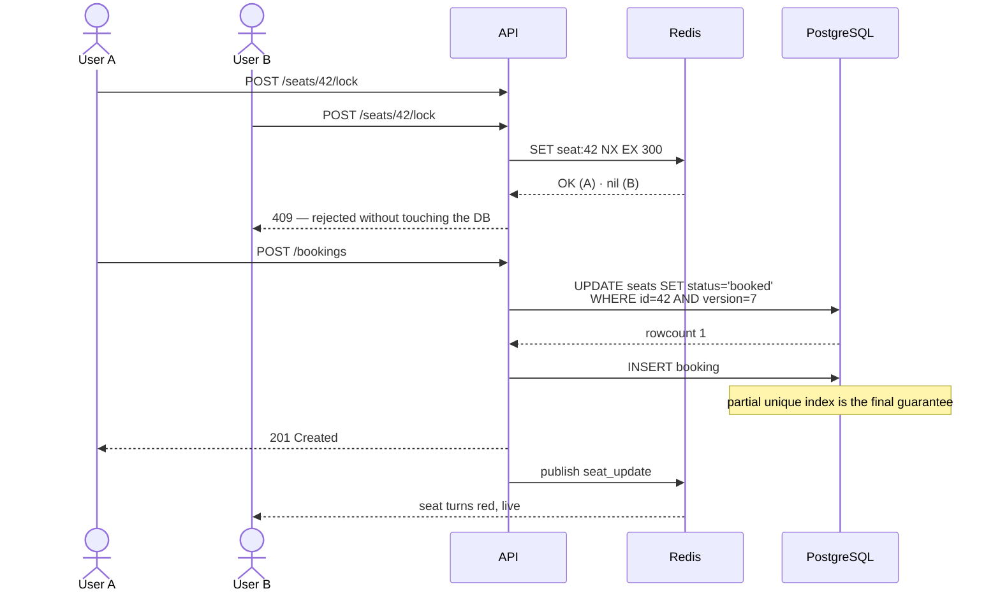
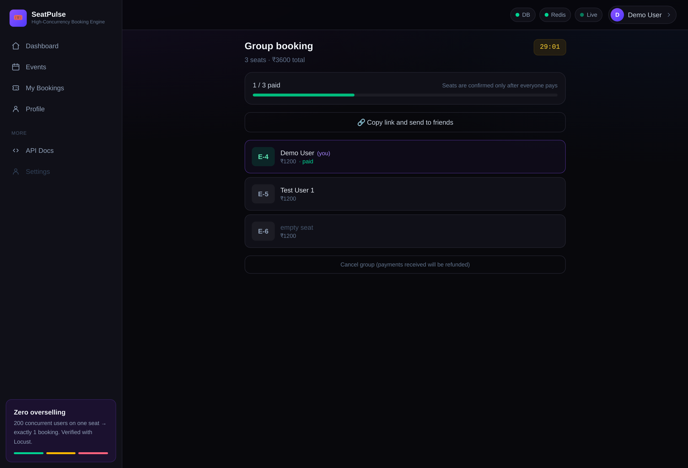
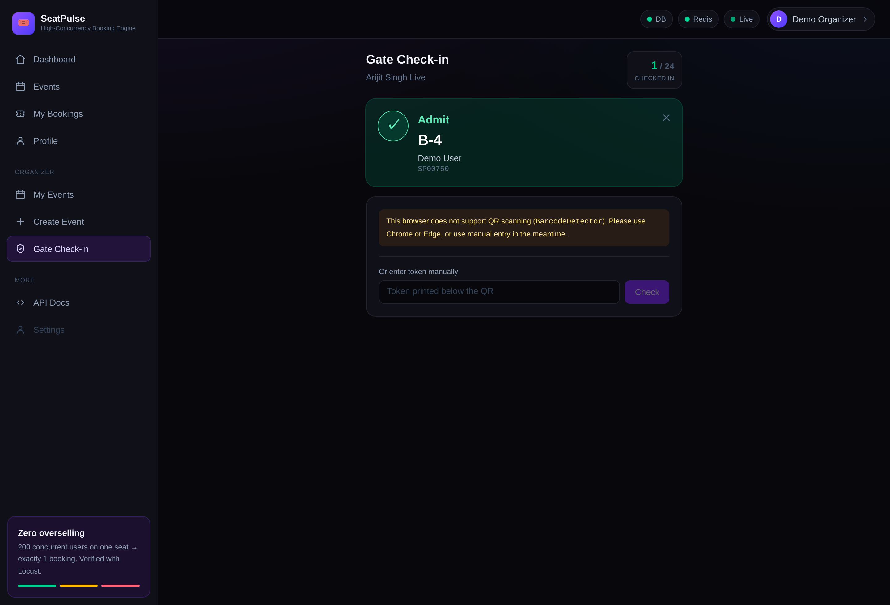
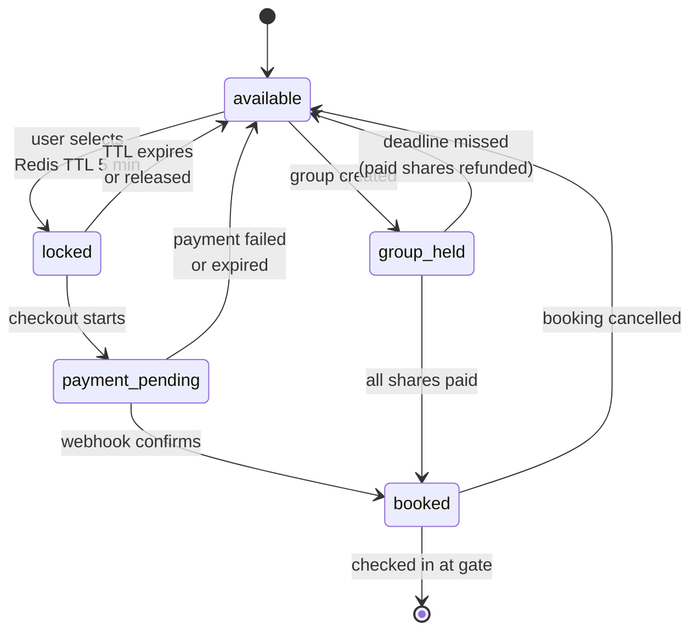

# SeatPulse

**High-concurrency event ticketing engine.** When 5,000 people click the same seat at the same instant, exactly one booking is created — and everyone else sees the seat turn red in real time.

<p align="center">
  
</p>

<p align="center">
  <em>Live seat grid — holds, purchases and bookings stream to every connected client over WebSockets.</em>
</p>

<p align="center">
  <a href="#quick-start">Quick start</a> ·
  <a href="#how-overselling-is-prevented">How it works</a> ·
  <a href="#measured-results">Results</a> ·
  <a href="documents/">Engineering notes</a>
</p>

---

## Overview

| | |
|---|---|
| **Backend** | FastAPI (ASGI), Python 3.11, Pydantic v2, SQLAlchemy 2.0, Alembic |
| **Data** | PostgreSQL 16, Redis 7 (locks, pub/sub, rate limiting, cache) |
| **Frontend** | React 19, Vite, Tailwind CSS v4, WebSockets |
| **Async** | ARQ worker (PDF tickets, QR codes, scheduled expiry) |
| **Infra** | Docker Compose (dev + prod targets), GitHub Actions CI |
| **Tests** | 110 integration tests against a live stack |

---

## Architecture



Redis pub/sub — rather than an in-process dictionary — is what lets broadcasts survive across worker processes. That claim is [verified by a test](documents/phases/16-multiworker-ci.md), not assumed.

---

## How overselling is prevented

A naive `SELECT` → check → `UPDATE` sells the same seat many times under load. SeatPulse layers three independent defences, so correctness never rests on application code alone.



| Layer | Mechanism | Role |
|---|---|---|
| 1 | Redis `SET NX EX` | Fast rejection — most requests never reach the database. TTL frees abandoned carts automatically |
| 2 | Optimistic locking (`version` column) | Two concurrent updates: one wins, the other's `WHERE version = ?` no longer matches → `409` |
| 3 | Partial unique index | Holds even if Redis is down or the application logic has a bug |

The same **atomic conditional update** pattern reappears at every "exactly once" decision in the system — seat booking, payment fulfilment, gate check-in, and group confirmation.

---

## Measured results

Locust against the Docker Compose stack, single uvicorn worker, all services on one machine.

**Flash sale — 200 authenticated users contending for one seat**

| Metric | Value |
|---|---|
| Total requests | 8,154 |
| Throughput | 137 req/s |
| HTTP failures | **0** |
| p50 / p99 | 1,000 ms / 1,400 ms |
| Confirmed bookings in DB | **1** |
| Integrity violations | **0** |

**Realistic browsing — 50 concurrent users**

| Endpoint | p50 | p95 | p99 |
|---|---|---|---|
| `GET /events/{id}/seats` | 21 ms | 95 ms | 200 ms |
| `POST /seats/{id}/lock` | 33 ms | 130 ms | 150 ms |
| `POST /bookings` | 41 ms | 83 ms | 150 ms |

### Three bugs load testing caught

1. **Lost-update race.** `lock_seat`'s `UPDATE` had no status guard, so a seat booked microseconds earlier could be flipped back to `locked`. A 20-request test never hit that window; 500 concurrent users did.

2. **bcrypt holding a transaction open.** Login read the user, then spent ~100 ms hashing before committing. Under load `pg_stat_activity` showed **50 of 50 connections `idle in transaction`, 1 active** — everything holding, nothing working.

3. **In-flight requests outnumbering the pool.** Sync routes take a connection at request start, then wait for a threadpool slot while holding it. Growing the pool only moves the cliff. Fixed with admission control — a semaphore that makes requests queue at the door instead of failing inside:

   ```
   MAX_CONCURRENT_REQUESTS (30) < pool_size + max_overflow (40) <= threadpool (40)
   ```

Same 200-user flash sale, before and after: **1,250 requests / 58 failures / 21 s p99 → 8,154 requests / 0 failures / 1.4 s p99.**

Full method and raw numbers: [Load testing](documents/phases/06-load-testing.md).

---

## Quick start

Only Docker Desktop is required.

```bash
git clone https://github.com/Nitishjha7/seatpulse-event-engine.git
cd seatpulse-event-engine

cp .env.example .env
cp backend/.env.example backend/.env
cp frontend/.env.example frontend/.env

docker compose up --build -d
docker compose exec backend alembic upgrade head
docker compose exec backend python seed.py
```

> PowerShell: use `Copy-Item .env.example .env` instead of `cp`.

| Service | URL |
|---|---|
| Frontend | http://localhost:5173 |
| API | http://localhost:8000 |
| Swagger | http://localhost:8000/docs |
| Health | http://localhost:8000/api/health |

**Demo accounts** — all use password `demo1234`:

| Email | Role |
|---|---|
| `demo@seatpulse.dev` | attendee |
| `organizer@seatpulse.dev` | organizer |
| `admin@seatpulse.dev` | admin |

---

## Features

<p align="center">
  
  
</p>

| Area | What it does | Notes |
|---|---|---|
| **Concurrency** | Redis lock → optimistic version → partial unique index | [Phase 4](documents/phases/04-redis-locking.md) |
| **Real time** | Seat changes broadcast over Redis pub/sub → WebSocket | Survives multiple worker processes |
| **Auth** | JWT access in memory, refresh in httpOnly cookie, `jti` whitelist for revocation, Google OAuth | [Phase 7](documents/phases/07-auth-google-oauth.md) |
| **Payments** | Webhook is the source of truth, HMAC-verified, idempotent fulfilment, reconciliation job | [Phase 11](documents/phases/11-payments.md) |
| **Tickets** | ARQ worker renders QR + PDF off the request path, with retries | [Phase 12](documents/phases/12-background-tickets.md) |
| **Gate check-in** | Camera QR scan; one atomic statement admits exactly once | [Phase 13](documents/phases/13-gate-checkin.md) |
| **Dynamic pricing** | Demand-based surge; the quoted price is **locked at hold time** so checkout never costs more than shown | [Phase 14](documents/phases/14-dynamic-pricing.md) |
| **Group booking** | Shareable split-payment link, all-or-nothing against a deadline | [Phase 17](documents/phases/17-group-booking.md) |
| **Seat layouts** | Sections, per-row seat counts, aisles — validated server-side | [Phase 18](documents/phases/18-seat-layout.md) |
| **AI search** | A sentence becomes validated filters; an ordinary query runs them | [Phase 19](documents/phases/19-nl-seat-search.md) |
| **Rate limiting** | Token bucket in Lua, keyed to identity — never to IP | [Phase 9](documents/phases/09-rate-limit-idempotency.md) |
| **RBAC** | Three flat roles, with ownership checked separately from role | [Phase 10](documents/phases/10-rbac-organizer.md) |

Optional integrations degrade gracefully: no Google keys hides the login button, no Stripe keys switches to a mock provider, no Gemini key hides the AI search box. Nothing breaks.

---

## Booking lifecycle



---

## Testing

```bash
docker compose exec backend pytest tests/ -q        # 110 integration tests
docker compose exec backend python verify_integrity.py

# Flash sale
docker compose --profile loadtest run --rm locust \
  -f locustfile.py FlashSaleUser --headless -u 500 -r 100 -t 30s \
  --host http://backend:8000
```

Tests run against a **live stack** rather than mocks, because race conditions only appear when uvicorn, Redis and Postgres are all really running. None of them require an AI API key.

More: [testing reference](documents/reference/testing.md).

---

## Project structure

```
backend/          FastAPI app — routers, models, Redis, ARQ worker, tests
frontend/         React app — seat grid, booking context, organizer + gate portals
loadtest/         Locust scenarios, locking benchmark, multi-worker verification
documents/        Phase-by-phase engineering notes and decisions
.github/          CI: full stack, 110 tests, production image assertions
```

---

## Engineering notes

Every feature is documented with the reasoning behind it — including the decisions that turned out to be wrong.

| | |
|---|---|
| [Phase index](documents/) | All 20 phases, what each one changed and why |
| [Locking benchmark](documents/phases/15-locking-benchmark.md) | Optimistic vs `SELECT … FOR UPDATE`, measured. The assumption did not hold |
| [Multi-worker + CI](documents/phases/16-multiworker-ci.md) | Three bugs that only a clean database exposed |
| [Interview prep](documents/interview-prep.md) | Deep Q&A on the design decisions |

---

## Not built

Stated plainly rather than implied:

- **AI poster generator** — Gemini's free tier has no image quota; every image model returns 429. The text half shipped.
- **Demand forecasting** — deliberately left out. Without real historical data it produces a plausible-looking number rather than a useful one.
- **Live deployment** — production compose, nginx config and non-root images are ready; nothing is hosted yet.
